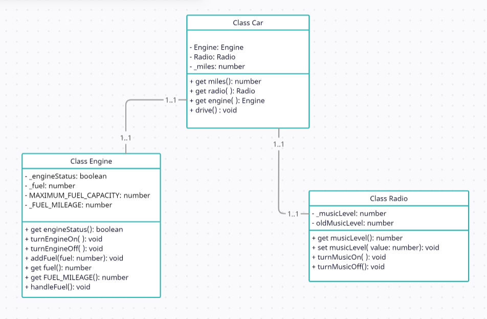

# Single responsibility principle

## Theory
A class should only have a single responsibility, that is, only changes to one part of the software's specification should be able to affect the specification of the class.
That might sound very theoretic so look at the old.ts file and open the index.html file, you can see the software has some options to handle fuel, music and the engine.
There are a couple of problems with this:

- The Car class is a classic example of a so-called “God object” — that is, an object that knows about and does everything. These types of objects are really hard to maintain, extend and test.
- We have to prefix every variable with the correct domain eg. "engineStatus". It would be nicer to just name it "Status" but we cannot do this in the car because you might confuse it with the status of the MusicPlayer.
- What if want different types of engines with different ways of consuming fuel? We would have to put a lot of extra if-statements in our car class.

## Your mission
Look at the old.ts file and open the index.html file, you can see the software has some options to handle fuel, music and the engine. However, these are really 3 separate domains making the current Car object really strange.
Refactor the code, so we have at least a separate class for Car, Engine and MusicPlayer. Where do you think we should place the fuel functionality?

### Extra challenge
Make a new type of Engine that also consumes Fuel

-----
### How I solved this exercise

To be honest this exercise was a challenge for me. I wasn't sure if I am on the right track or not. I talked about
Single responsibility principle with a lot of my classmates and tried to understand it by searching about it online
and looking at different examples.

I used Parcel to compile TS to JS and the code structure is as below :

I create an instance of the Engine and Radio in the Car constructor.
Then use getters to access them from outside the class. I thought about separating the fuel tank too, but after a 
lot of discussion with my classmates, figured it might be overdoing it and as my coach said, 
it might be like "going to the rabbit hole".

I am still not sure if what I have now is correct, and I know that there are always some ways to make it better,
but I think it's good enough to move on to the next exercise!

