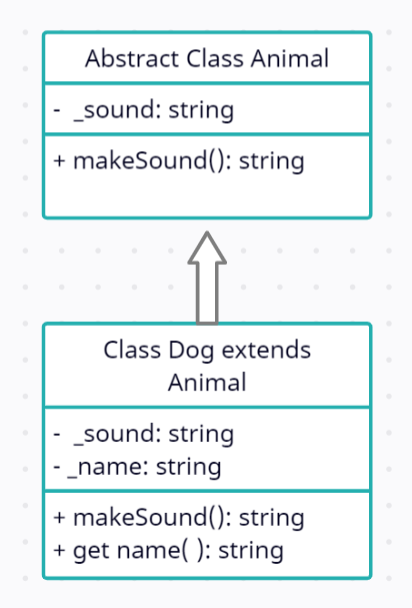

# Open–closed principle
Classes should be open for extension, but closed for modification. In more simple words you can always add new code to an object, but you should never change the design of old code.

It is much better to work with **dependencies**, meaning passing an object to another object as a parameter. 

Ideal code should be written with the **Blackbox** principle in mind, you should be able to guess what a function does just looking at its signature.

Consider how the coupling of two entities affects their respective maintainability. The more a given entity knows about how another one is implemented, the more we can say that they are coupled. Therefore, if one of the two entities is changed, then the other must be changed too.

### Arrays with meaning
Other examples of bad code practices not listing to the Open Closed Principle is having objects return Associative Arrays with meaning (the labels are used later on outside the class)

````typescript
function getProducts() {
    return [{'name': 'chair', 'price': 5}, {'name': 'table', 'price': 15}, {'name': 'bed', 'price': 20}];
}
//the zero at the end refers to the default value when no total has been calculated yet (first value of total)
// This is needed in case the getProducts() returns an empty array
let totalPrice = getProducts().reduce((total, product) => total + product.price, 0);
````

You can improve on this in 2 ways in TypeScript, you can create a Product class or create a literal:
````typescript
    type Product = {'name': string, 'price': number};
    type ProductCollection = Product[];
````

## Your mission
Look at the old.ts file, and you see a bunch of animals in a zoo, all making the sounds.
Now add another animal (you can choose your favorite animal), and make sure it makes a sound.

Did you notice you needed to alter the Zoo object even when all you did was add a new Animal class? Would it not be much better to move the `makeSound` function to each Animal class, so each animal can decide for himself what sound he makes instead of the Zoo class?

Create a `makeSound` function to each Animal class and remove the giant switch from the Zoo class. Now you can easily add new animals without altering an existing class!
-----

### How I solved this exercise

For this exercise , I added one abstract class called Animal, and extended other classes from it. Added the sound as
property, and the function makeSound to the base class (abstract class) , which returns the sound as a string.

The code structure is as below:




By adding the code below to the subclasses, I didn't have to write the makeSound method again.

```
constructor() {
        super();
    }
```
#### The Super keyword
- The super keyword can be used to reference the base class properties and constructor.
- Super call is only allowed in the constructor of derived classes.
---
