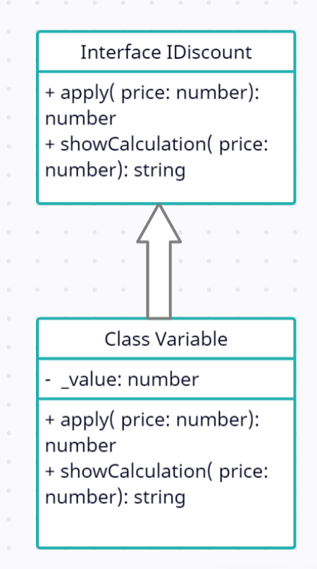

# Liskov substitution principle
"Objects in a program should be replaceable with instances of their subtypes without altering the correctness of that program." See also [design by contract](https://en.wikipedia.org/wiki/Design_by_contract).

### Polymorphism
You might already be aware of Polymorphism, but just to remind you, here is the short summary:
If 2 different classes use **the same interface**, so they have the same function names: the code that uses this class does not care about which one class it receives.
In short: When two objects have the same interface, they are functionally interchangeable = polymorphism.

## Your mission
Look at the old.ts file and open the index.html file, refactor the Discount class in 3 different classes with the same interface "VariableDiscount" & "FixedDiscount" & "NoDiscount"

### Discuss
Do you understand what the use is of having the class NoDiscount? This prevents us from having to write extra if-statements inside product to check if we actually have a Discount dependency. It might look strange but these null or void classes are very common in a lot of popular libraries!

---

### How I solved this exercise

As it is mentioned in the description , I created an Interface called IDiscount, separated three types of discount into
three classes that implement the interface. I had some compilation errors which was solved by adding type module
to my script tag in index.
```
<script src="new.js" type="module"></script>
```
`what is a JS module?
It's just a JS file, but it also specify which variables and function can be accessed outside the module.`


This error happened since I had my classes in different files and imported them to new.js.

The Class structure in the new version is as below:


